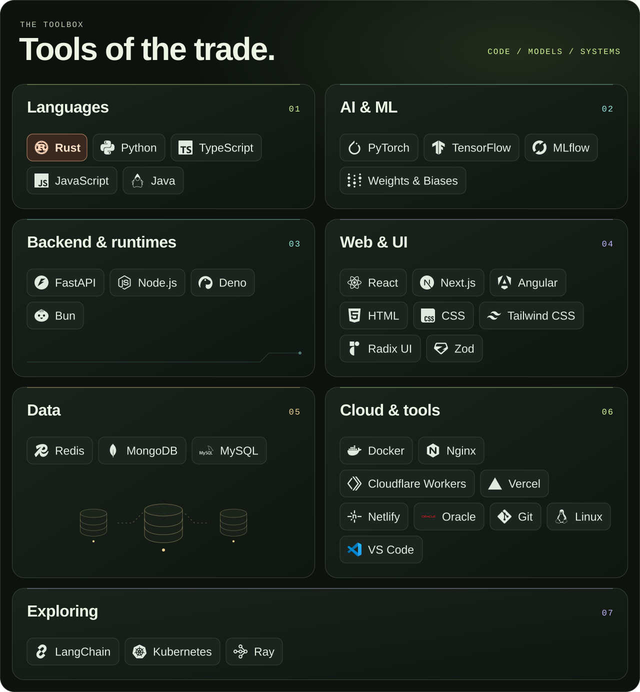

<picture>
  <source media="(max-width: 600px)" srcset="./assets/hero-mobile.svg">
  
</picture>

  <a href="#focus">Focus</a> &nbsp; / &nbsp;
  <a href="#toolbox">Toolbox</a>

 

I'm **DaYzTm**, a developer working across **AI, APIs, and infrastructure**.
I like connecting the pieces: models with applications, interfaces with services, and experiments with working software.

## Focus

**01 &nbsp; / &nbsp; AI & APIs** — model integrations, Python services, and the interfaces that make AI useful.

**02 &nbsp; / &nbsp; Web & interaction** — TypeScript applications, interactive interfaces, and browser-based experiments.

**03 &nbsp; / &nbsp; Infrastructure** — containers, reverse proxies, and services that run locally or at the edge.

 

## Toolbox

<picture>
  <source media="(max-width: 600px)" srcset="./assets/toolbox-mobile.svg">
  
</picture>

<b>Explore the full stack</b>

| Layer | Technologies |
| :--- | :--- |
| **Languages** | `Rust` · `Python` · `TypeScript` · `JavaScript` · `Java` |
| **AI & ML** | `PyTorch` · `TensorFlow` · `MLflow` · `Weights & Biases` |
| **Backend & runtimes** | `FastAPI` · `Node.js` · `Deno` · `Bun` |
| **Web & UI** | `React` · `Next.js` · `Angular` · `HTML` · `CSS` · `Tailwind CSS` · `Radix UI` · `Zod` |
| **Data** | `Redis` · `MongoDB` · `MySQL` |
| **Cloud & tools** | `Docker` · `Nginx` · `Cloudflare Workers` · `Vercel` · `Netlify` · `Oracle` · `Git` · `Linux` · `VS Code` |
| **Exploring** | `LangChain` · `Kubernetes` · `Ray` |

 

  <b><a href="https://github.com/DaYzTm?tab=repositories">Explore the code ↗</a></b> 
  Russian / English

